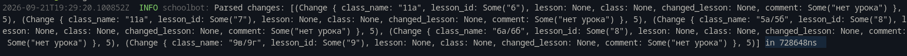

# Highly optimised school lessons parser with the telegram bot

Warning: this project is currently in deep developing. Do not use it.

## Why use this bot
- It's fast.
- I tried to reduce amount of allocations.
- It automaticly notifies everyone when new lessons are dropped.

## What's used
- Telers: the best telegram bot crate for rust.
- Reqwest: for fetching the pages.
- Tl: for parsing HTML
- And other crates for internal work.

# Roadmap
- [DONE] Make blazing lessons changes parser
- [UNDONE] Make the lessons parser
- [UNDONE] Make the telegram bot
- [UNDONE] Connect the database for lessons history and etc.

# Progress
- It parses lessons changes in 0.72ms!

## License

This project is licensed under the GNU General Public License v3.0 - see the [LICENSE](LICENSE) file for details.

### Summary of Rights & Obligations

This project is **Free Software**: you can share it, modify it, and reuse it. 

* **Permissions**: Commercial use, modification, distribution, patent use, and private use.
* **Conditions**: You must include a copy of the original license and copyright notice. Any modifications or larger works derived from this code **must also be licensed under the GPLv3** and made open source.
* **Limitations**: Provides no warranty or liability.